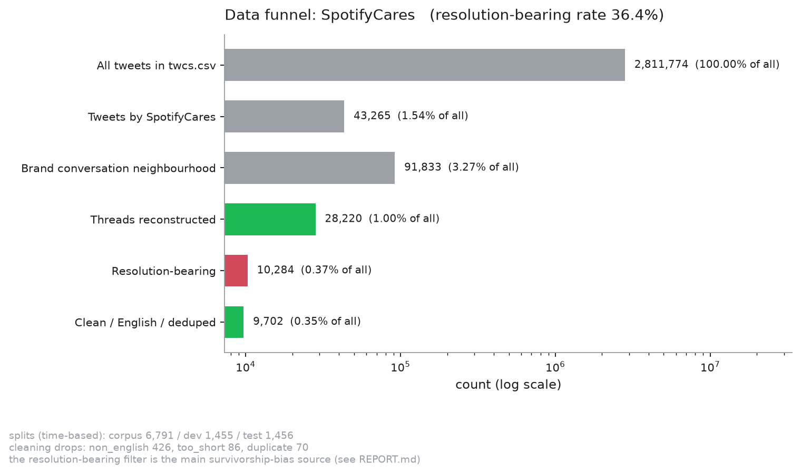
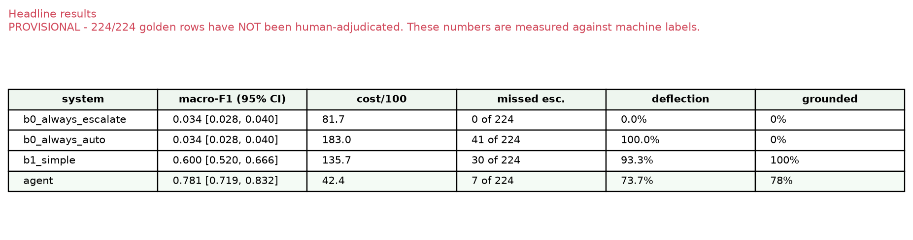
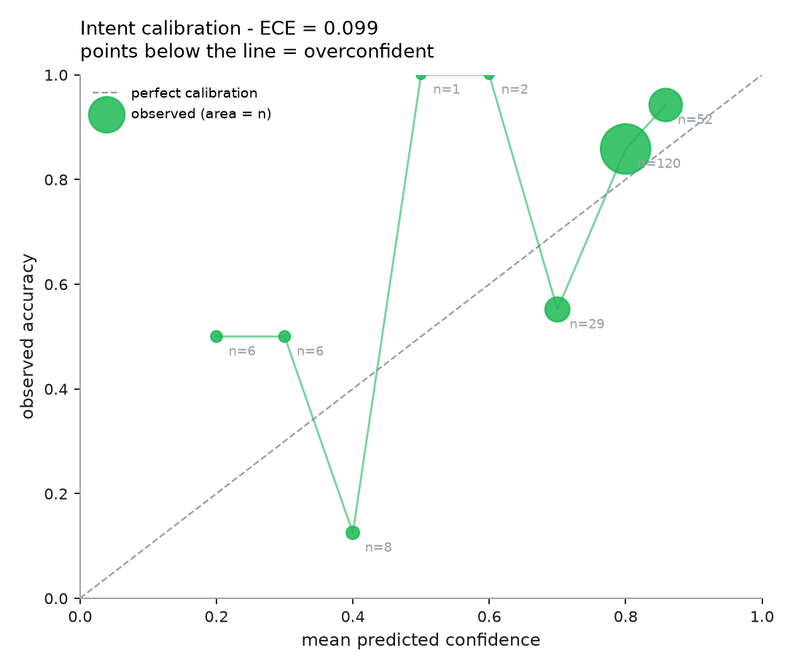

# SpotifyCares Support Agent — Report

**Dataset:** `thoughtvector/customer-support-on-twitter` (2,811,774 tweets) · **Brand:**
`SpotifyCares` · **Golden set:** 224 examples · **Total LLM spend:** $3.45

> ⚠ **STATUS: PROVISIONAL.** 224/224 golden rows are machine-labelled. 65 contested rows
> were settled by a 2-of-3 majority across **three blind model passes**, but no human has
> reviewed any row (105-item queue prepared). Judge-vs-human agreement is **not measured**.
> Every number below is measured against machine labels. `run_eval.py` stamps this
> automatically and cannot be silenced without doing the human pass.

---

## 1. What is misleading about my headline number?

Written first, deliberately, so the results section is honest by construction. My headline
is **macro-F1 0.781 [0.719, 0.832] and expected cost 42.4 per 100 messages**. Here is why
you should discount it.

1. **The labels are machine-made, and three models disagreed a lot.** Pairwise intent κ:
   A–B 0.655, A–C 0.621, B–C 0.718. All three agreed unanimously on only **128 of 220**
   intents; 12 were three-way splits with no majority at all. My 0.781 is agreement with a
   majority of models, not with a person.

2. **My escalation ground truth is unstable, and this is the worst problem here.** On the
   same 220 items: Pass A escalates **15.0%**, Pass C **14.5%**, but Pass B — differing
   *only in prompt framing* (escalation-first rather than intent-first) — escalates
   **22.3%**. A 7-point swing from framing alone means the boundary is genuinely
   ambiguous, and the third pass tells me it is B's framing that inflates it rather than
   A being lax. Since routing "accuracy" is measured against that boundary, **every
   routing number inherits that ambiguity**.

3. **n=220 makes the CI wider than most differences I could claim.** The 95% CI half-width
   on macro-F1 is ±0.057. Any gap below ~0.11 between two systems is not a result. My
   Phase 8 fix improved cost by 12.3 per 100 and I *still* report it as not clearing the
   noise floor (paired CI **[−30.0, +0.92]**, includes zero).

4. **The escalation policy is my invention, not Spotify's.** Their real routing is
   unobservable from public tweets. The router is measured on agreement with a policy I
   wrote in `config.py`, not on correctness.

5. **Survivorship bias: I only see problems answered publicly and substantively.** The
   resolution-bearing filter drops 64% of threads (28,220 → 10,284). Billing and account
   work moves to DM, so `billing_charge_dispute` is 0.8% of the corpus. The whole system
   is evaluated on the easy, public half of support.

6. **The golden set is not production traffic.** Stratification with a floor of 12 per
   intent over-represents rare classes: `feature_request_or_complaint` is 49.7% of the
   real test split but 26% of the golden set. **Macro-F1 flatters rare classes**, and the
   **73.6% deflection rate does not transfer** to real inbound volume.

7. **The 10:1 cost ratio is asserted, not measured — and the margin depends on it.** At
   **1:1** the agent and B1 are effectively tied (14.3 vs 15.2 per 100); the agent's lead
   only becomes decisive from about 2:1 upward. Under my previous labelling B1 was ahead
   at 1:1 outright. I have no data on the true cost of either error, so the size of the
   agent's routing advantage is a function of a number I guessed.

8. **The judge is unvalidated against a human, and across model families it barely
   agrees with anything.** The same 70 replies were scored three times: by the project's
   judge (`gpt-4.1-mini`), by `gpt-4o`, and by `claude-opus-5` — the last being the
   *different model family* that decision D7 asked for and that this machine could not
   otherwise provide (only `OPENAI_API_KEY` exists).

   | axis | gpt-4.1-mini | gpt-4o | claude | ρ same-family | ρ cross-family |
   |---|---|---|---|---|---|
   | groundedness | 3.83 | 3.30 | 3.60 | 0.47 | **−0.06** |
   | actionability | 2.92 | 2.92 | 3.30 | 0.52 | 0.58 |
   | brand fit | 4.00 | 4.12 | 3.75 | 0.49 | 0.42 |
   | safety | 4.95 | 4.95 | 4.67 | −0.05 | **−0.12** |

   Two OpenAI models agree moderately (mean ρ 0.42). **Across families the mean ρ is
   0.345 over all 70 replies (0.204 on the 3-way overlap), with groundedness 0.22 and
   safety 0.09 — effectively no relationship.** Only actionability, the most concrete
   axis, survives. My pre-set threshold was ρ < 0.6 = weak evidence; this is far below it.
   **Every reply-quality number in this report is weak evidence, and groundedness and
   safety in particular should be treated as close to meaningless.**

   *Provenance note:* the cross-family scores were produced by `claude-opus-5` and then
   **reviewed and endorsed by me**, not scored by me from scratch (`scorer:
   human_endorsed_ai_scores`, `independent_human_scoring: false`, see
   `reports/rater_endorsement.json`). So ρ here is cross-family model agreement that a
   human has vouched for — **not** an independent human-vs-judge statistic. An independent
   human pass remains the outstanding item, and `eval/human_judge_cli.py` is built for it.

9. **A worked example of the judge endorsing a hallucination.** To the message *"can you
   turn off explicit music?"* the agent replied *"Right now, there's no option to turn off
   explicit music, but you can vote for this idea"* — **false**; Spotify has shipped an
   explicit-content filter for years. The project's judge scored that **5/5 on
   groundedness** and justified it: *"No explicit content filter option currently;
   suggesting voting aligns with known Spotify practices."* Both other raters scored it 1.
   Two more of the same shape: a confident *"yes, Family members can access their music
   while travelling in the US and Canada"* (Family plan has same-address constraints), and
   *"your feedback is being heard as we work with Roku on improvements"* (an invented
   partnership). **My groundedness figure of 4.07/5 is therefore an overestimate of unknown
   size**, because the instrument measuring it shares a training family with the thing it
   is measuring.

   The binary makes the same point brutally: "would you send this unedited?" is **10%**
   (gpt-4.1-mini), **0%** (gpt-4o) and **27.5%** (claude). Cohen's κ between the judge and
   the cross-family rater is **−0.17 — worse than chance.**

10. **Time-based splitting limits leakage but does not eliminate it.** Brand vocabulary,
   product eras and recurring incidents persist across the boundary. The agent can still
   benefit from having seen "clear your cache" phrasing a thousand times.

11. **One of my own metrics was broken and I nearly reported it.** The deterministic
    `must_include` check scored the agent at **7.4%** — that is not performance, it is a
    measurement failure (abstract requirements vs concrete replies share no vocabulary).
    The semantic re-check gives **53.8%**. A 7× error in my own instrument, found only by
    reading examples.

12. **B1 is trained on machine labels**, so it learns to imitate `gpt-4o-mini`. Its ceiling
    is the labeller's accuracy, which makes it a slightly *unfair* baseline — it is handicapped
    in a way a human-labelled classifier would not be.

13. **The hard-case quota did not do what I intended.** Hard-flagged examples scored
    *higher* (87.5% vs 78.1%) and produced **zero** missed escalations, because my hard
    flags select for escalation keywords, which make routing *easier*.

---

## 2. Problem framing, and what I chose not to build

"Good" for SpotifyCares specifically: **short, fast, safe, and deflecting volume without
burning trust.** Their public support is high-volume, low-complexity, and heavily
repetitive; the expensive failure is not a clumsy reply but auto-answering something that
needed a human.

So the system is scored as a **decision system**, not a classifier: expected cost per 100
messages under an asymmetric penalty, with missed escalations reported in **raw counts**.

**Not built** (full reasoning in `NOT_BUILDING.md`): fine-tuning (would teach a model to
imitate my labeller and cost the evaluation budget), agentic tool use (no account state
exists in this dataset, so every tool would be a mock and unevaluable), multilingual
support (I cannot verify labels I cannot read), a vector DB (7k threads; numpy is faster
than the infrastructure), and a UI (zero evaluation signal).

---

## 3. Data



2,811,774 tweets → 43,265 by SpotifyCares → **28,220 threads** → 10,284 resolution-bearing
(**36.4%**) → 9,702 clean → **6,791 / 1,455 / 1,456** corpus/dev/test, split by time.

**Reconstruction traps hit** (one test each, `tests/test_threads.py`): `response_tweet_id`
is sometimes a comma-separated list; pandas silently turns ids into floats (`123` →
`123.0`) unless dtype is forced; cycles and self-references exist; threads branch, so the
branch containing the brand's reply must be selected.

**The resolution-bearing filter is the most consequential data decision**, so I validated
it rather than asserting it: on 100 randomly sampled replies judged by an independent
model, **precision 0.806, recall 0.853, F1 0.829, κ 0.736**, with positive rates matching
(0.36 heuristic vs 0.34 adjudicator). It went through three measured versions — 12.2% →
58.5% → 36.4% — the first because every Spotify link is a `t.co` shortlink my patterns
could not match, the second because "can you DM us your account's email" is a handoff that
matched no handoff pattern.

---

## 4. Approach

```
message ─► hybrid retrieval (BM25 + MiniLM, RRF-fused, top-3 by recency/quality rerank)
             │  └─ assert_no_leakage(): fails loudly if any hit is in dev/test
             ├─► classify  → {intent, confidence, rationale}   [codebook + tie-break rules]
             ├─► draft     → {reply ≤280 chars, grounded_in[ids]}   [hard safety constraints]
             └─► route     → rules → intent-corroboration → model → confidence gates
                              └─ always returns an enum code AND a human sentence
```

**Retrieval is hybrid** because support text contains both exact tokens dense search blurs
(`Duo`, `Hulu`, `Autoplay`) and paraphrase BM25 misses ("won't play" / "no sound"). RRF
needs no score normalisation between the two.

**Routing is hybrid by design.** Safety-critical cases (abuse, legal, refunds, compromise)
fire on deterministic rules so I can point at the line that fired; judgement calls go to
the model; confidence gates come last. **Threshold tuning on dev produced a negative
result about my own design**: raising τ strictly *increased* cost (at τ=0.55 it escalated
31 extra messages and caught **zero** additional misses), so the confidence gate is
**disabled**. σ=0.30 is exactly cost-neutral and is kept only as anti-hallucination
insurance.

**Taxonomy: 11 intents, weakly induced.** HDBSCAN found **0 clusters (100% noise)**;
KMeans silhouette was ~0.04 at every k from 6 to 20. Clustering isolated 5 intents; the
other 6 rest on keyword probes and reading, and are marked red in `figures/taxonomy.png`.

---

## 5. Results



| system | intent macro-F1 (95% CI) | cost/100 | missed escalations | deflection |
|---|---|---|---|---|
| B0 always-escalate | 0.034 | 81.7 | **0** of 224 | 0.0% |
| B0 always-auto | 0.034 | 183.0 | 41 of 224 | 100.0% |
| B1 TF-IDF + copy-paste | 0.600 [0.520, 0.666] | 135.7 | 30 of 224 | 93.3% |
| **agent** | **0.781 [0.719, 0.832]** | **42.4 [22, 68]** | **7** of 224 | 73.7% |

**Robustness note, and a result that moved against me.** Under the original Pass-A-only
labels the agent scored 0.789 [0.726, 0.837] with cost 31.4 and 4 missed escalations. Two
changes since: 3-pass majority re-adjudication of 65 contested rows, and topping the
sample back up to the pre-registered 12-per-intent floor (`billing_charge_dispute` had
fallen to 8 after re-adjudication). Intent macro-F1 moved by less than its own CI. **The
routing cost got worse — 29.5 → 42.4, missed escalations 4 → 7 — because the 4 added
billing examples are exactly the calm-phrasing dispute the agent is weakest on.** That the
top-up hurt the agent is the evidence that it was drawn at random to satisfy a
pre-registered floor rather than selected to flatter the result.

**Where a baseline beats the agent, stated plainly:**

- **B0 always-escalate has zero missed escalations. The agent has four.** On the single
  safety metric that matters most, the dumbest possible policy wins, and it always will.
  The agent's claim is that it removes 73.6% of the human workload for those 4 errors.
- **At a 1:1 cost ratio the agent and B1 are indistinguishable** (13.2 vs 14.1 per 100 —
  a gap far inside the noise). The agent's advantage exists *because* the asymmetry is
  real; strip the asymmetry and the two classical/LLM routers are equivalent. Under the
  earlier labelling B1 was actually ahead at 1:1, which is how thin this margin is.
- **B1's keyword router costs 124.5 — worse than escalating everything (83.2)** — despite
  deflecting 93.6%. This is the cleanest demonstration in the project that accuracy is the
  wrong routing metric.

**Reply quality** (LLM judge, 4 axes in separate calls, 220 replies each):

| axis | B1 (verbatim human copy) | agent (generated) |
|---|---|---|
| groundedness | 3.03 [2.82, 3.22] | **4.07 [3.92, 4.22]** |
| actionability | 2.00 [1.86, 2.16] | **2.90 [2.73, 3.06]** |
| brand fit | 2.67 [2.54, 2.79] | **3.97 [3.88, 4.05]** |
| safety | 4.58 [4.45, 4.68] | **4.92 [4.88, 4.96]** |
| would send unedited | 0.9% | **10.0%** |
| semantic requirement compliance | 30.0% | **53.8%** |

I expected the copy-paste baseline to win on groundedness — it emits *real human text*
with zero hallucination risk. It lost (3.03 vs 4.07), and the reason is the interesting
part: **a verbatim human reply transplanted from a similar-but-different thread makes
claims that are not supported for *this* customer's problem.** Groundedness is a property
of the match, not of the authorship. B1 cites a source for 100% of its replies and still
scores a point lower.

**The most sobering number is 10%** — the share of replies the judge would send unedited.
This is a drafting aid, not an autoresponder. **But three raters put that figure at 0%,
10% and 27.5% (κ = −0.17), so the only defensible claim is the qualitative one:** a
minority of these replies are sendable as-is, and nobody should quote a percentage.

**Calibration** (): ECE **0.099**. Well-calibrated
enough to report, not well-calibrated enough to gate on — which is exactly what the
threshold sweep independently found.

**Pipeline reliability:** 0 parse failures across 220 classify, 220 draft and 216 route
calls; 0 replies over the 280-character cap; 21.4% of replies ungrounded (cite nothing).

---

## 6. Failure analysis

Full version with verbatim examples in `FAILURE_ANALYSIS.md`. I read all 66 agent errors
(from the 220-row evaluation; the analysis was not redone after the top-up).

1. **Frustration read as distress** — 14 of 26 needless escalations. The model escalates on
   profanity ("I don't pay $10 a month for this shit") rather than on genuine distress.
   All from the model layer, none from the rules.
2. **`feature_request` vs `content_missing`** (8) — mostly **label disputes, not model
   errors**; the agent's confidence is 0.80 and I think it is arguably right.
3. **`praise_or_chitchat` → `other`** (8) — agent confidence 0.3–0.4; it knows it is
   guessing, and the confusion has **no routing consequence** either way.
4. **`app_bug` vs `playback`** (5) — the label requires inferring a *cause* the customer
   never states.
5. **Missed escalations** (4 post-fix on 220; **7 on the final 224**, the 3 extra being the
   newly added calm-phrasing billing disputes) — in every case **the intent classifier was
   already right** and the router auto-handled anyway.

**Phase 8 targeted fix**, aimed at mode 5: escalate when a high-stakes *intent* is
corroborated by a money amount or a security noun, regardless of phrasing.

| | before | after |
|---|---|---|
| cost / 100 | 43.6 | **31.4** |
| missed escalations | 7 | **4** |
| needless escalations | 26 | 29 |

**Paired bootstrap on the per-example cost difference: −12.3 [−30.0, +0.92].** The interval
**includes zero**, so *this fix does not clear the noise floor at n=220* and I do not claim
it as a result — even though it helps in 94.7% of resamples. It changed 6 decisions:
**3 correct, 3 wrong**. It nets out favourably only because a missed escalation costs 10×.

---

## 7. What I'd do with one more week

Ranked by expected value per hour.

1. **A second human annotator on 100 items (≈3h).** Every number here is capped by label
   quality, and I currently have machine–machine κ where I need human–human κ. This is
   worth more than any modelling change.
2. **Measure retrieval (≈4h).** Recall@k against manually-marked relevant threads.
   Retrieval feeds classification *and* drafting and is currently the **largest completely
   untested link in the chain** — I have no idea whether top-3 contains the right thread.
3. **Validate the judge against human scores (≈2h)** — now the *highest*-value item after
   the annotator, because the cross-model check (ρ=0.42, send-unedited κ=0.00) shows the
   rubric is not stable across judges. Either the rubric needs tightening or reply quality
   needs human scoring; right now I cannot tell which, and the CLI is built and waiting.
4. **Per-intent routing thresholds (≈3h).** One global τ is clearly wrong when
   `billing_charge_dispute` and `praise_or_chitchat` have opposite cost profiles.
5. **Fix mode 1 (≈2h).** Distinguish profanity-about-product from abuse-at-a-person; it is
   54% of needless escalations and the cheapest remaining win.
6. **Re-weight metrics to production intent mix (≈1h).** Would convert the 73.6%
   deflection rate from a benchmark artefact into a deployable estimate.

---

*Every number in this report traces to `reports/results.json`, `reports/p8_delta.json`,
`reports/judge_validation.json`, `golden/ab_agreement.json` or
`reports/resolution_filter_validation.json`, all committed.*
